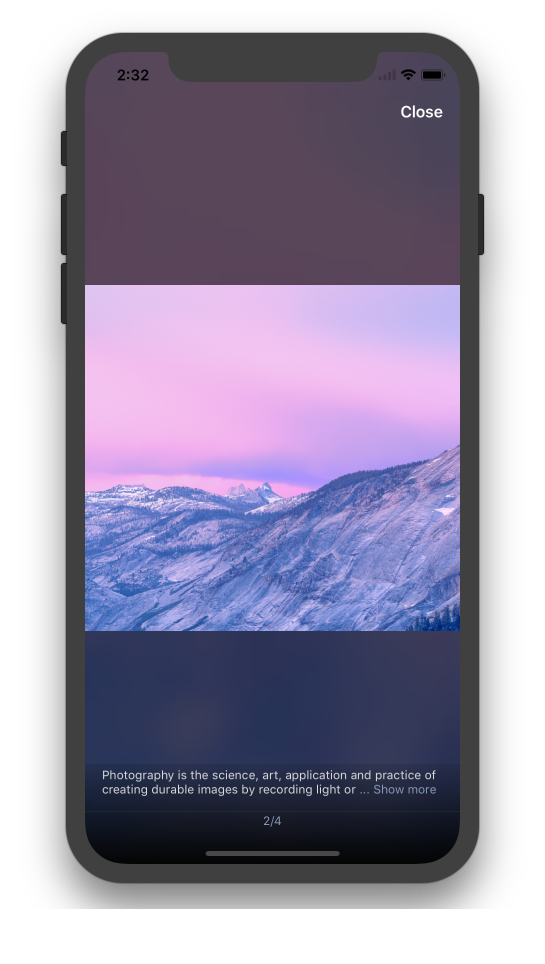
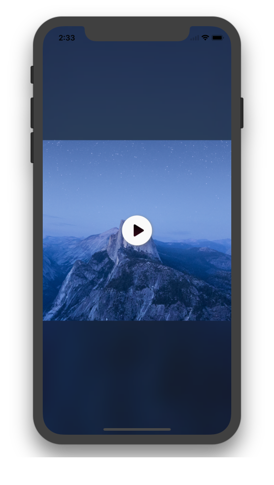

# Lightbox

[](https://circleci.com/gh/hyperoslo/Lightbox)
[](https://github.com/Carthage/Carthage)
[](http://cocoadocs.org/docsets/Lightbox)
[](http://cocoadocs.org/docsets/Lightbox)


**Lightbox** is a convenient and easy to use image viewer for your iOS app,
packed with all the features you expect:

- [x] Paginated image slideshow.
- [x] Video support.
- [x] Double-tap to zoom.
- [x] Image caption.
- [x] Dynamic background based on [Hue](https://github.com/hyperoslo/Hue)
- [x] Remote image loading and caching based on [Imaginary](https://github.com/hyperoslo/Imaginary)
- [x] Interactive transition animations.
- [x] Powerful configuration.
- [x] [Live Demo](https://appetize.io/app/wfgwc2uvg82m9pzbt17p4rrgh4?device=iphone5s&scale=75&orientation=portrait&osVersion=9.3)

<div align="center">


</div>

## Table of Contents

* [Usage](#usage)
  * [Controller](#controller)
  * [Delegates](#delegates)
  * [Image loading](#image-loading)
  * [Video](#video)
  * [Configuration](#configuration)
* [Installation](#installation)
* [Author](#author)
* [Contributing](#contributing)
* [License](#license)

## Usage

### Controller

To start your slideshow just instantiate `LightboxController`, set needed
delegates and present it:


```swift

// Create an array of images.
let images = [
  LightboxImage(imageURL: URL(string: "https://cdn.arstechnica.net/2011/10/05/iphone4s_sample_apple-4e8c706-intro.jpg")!),
  LightboxImage(
    image: UIImage(named: "photo1")!,
    text: "This is an example of a remote image loaded from URL"
  ),
  LightboxImage(
    image: UIImage(named: "photo2")!,
    text: "",
    videoURL: URL(string: "https://clips.vorwaerts-gmbh.de/big_buck_bunny.mp4")
  ),
  LightboxImage(
    image: UIImage(named: "photo3")!,
    text: "This is an example of a local image."
  )
]

// Create an instance of LightboxController.
let controller = LightboxController(images: images)

// Set delegates.
controller.pageDelegate = self
controller.dismissalDelegate = self

// Use dynamic background.
controller.dynamicBackground = true

// Present your controller.
present(controller, animated: true, completion: nil)
```

### Delegates

Use `LightboxControllerPageDelegate` if you want to be notified about page
navigation changes.

```swift
extension ViewController: LightboxControllerPageDelegate {

  func lightboxController(_ controller: LightboxController, didMoveToPage page: Int) {
    print(page)
  }
}
```

Use `LightboxControllerDismissalDelegate` to be notified when controller is
about to be dismissed. Please note that `LightboxController` dismisses itself
if it was presented initially.

```swift
extension ViewController: LightboxControllerDismissalDelegate: class {

  func lightboxControllerWillDismiss(_ controller: LightboxController) {
    // ...
  }
}
```

### Image loading

By default images are loaded using [Imaginary](https://github.com/hyperoslo/Imaginary) for reliable loading and caching. But it's easy to change this behavior using **LightboxConfig**

```swift
LightboxConfig.loadImage = {
  imageView, URL, completion in
  // Custom image loading
}
```

### Video

**Lightbox** can show and plays video using default `AVPlayerViewController`. Showning video by using `videoURL`:

```swift
LightboxImage(
  image: UIImage(named: "photo2")!,
  text: "",
  videoURL: NSURL(string: "https://clips.vorwaerts-gmbh.de/big_buck_bunny.mp4")
)
```

Override video handling if needed:

```swift
LightboxConfig.handleVideo = { from, videoURL in
  // Custom video handling
  let videoController = AVPlayerViewController()
  videoController.player = AVPlayer(url: videoURL)

  from.present(videoController, animated: true) {
    videoController.player?.play()
  }
}
```

### Configuration

Configure text, colors, fonts of UI elements by overriding the static
variables in the **Lightbox** [configuration](https://github.com/hyperoslo/Lightbox/blob/master/Source/LightboxConfig.swift) struct. As an example:

```swift
LightboxConfig.CloseButton.image = UIImage(named: ImageList.Lightbox.closeButton)
LightboxConfig.CloseButton.textAttributes = TextAttributes.Lightbox.closeButton
LightboxConfig.CloseButton.text = "Finish"

LightboxConfig.DeleteButton.image = UIImage(named: ImageList.Lightbox.deleteButton)
LightboxConfig.DeleteButton.textAttributes = TextAttributes.Lightbox.deleteButton
LightboxConfig.DeleteButton.text = "Delete"

LightboxConfig.InfoLabel.ellipsisText = "Show more"
```

## Installation

**Lightbox** is available through [CocoaPods](http://cocoapods.org). To install
it, simply add the following line to your Podfile:

```ruby
pod 'Lightbox'
```

In order to quickly try the demo project of a **Lightbox** just run
`pod try Lightbox` in your terminal.

**Lightbox** is also available through [Carthage](https://github.com/Carthage/Carthage).
To install just write into your Cartfile:

```ruby
github "hyperoslo/Lightbox"
```

To install **Lightbox** manually just download and drop `Sources` and
`Images` folders in your project.

## Author

Hyper Interaktiv AS, ios@hyper.no

## Contributing

We would love you to contribute to **Lightbox**, check the [CONTRIBUTING](https://github.com/hyperoslo/Lightbox/blob/master/CONTRIBUTING.md) file for more info.

## License

**Lightbox** is available under the MIT license. See the [LICENSE](https://github.com/hyperoslo/Lightbox/blob/master/LICENSE.md) file for more info.
